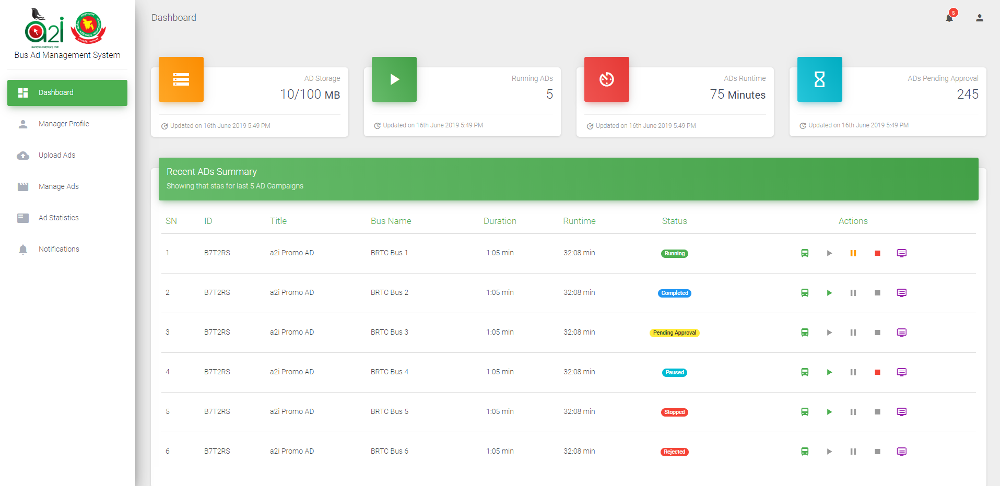

 
  <b>a2i Bus AD Management System</b>

## Demo

The demo can be viewed <a href="https://rafathossain96.github.io/a2i-Bus-AD-Management-System-Manager-Dashboard/" target="_blank">here</a>.

## Features

<ul>
  <li>Upload new AD</li>
  <li>Manage ADs</li>
  <li>View AD Statistics</li>
  <li>Get notified on updates</li>
</ul>

# License

### Dashboard Template
Material Dashboard - is a free Material Bootstrap 4 Admin with a fresh, new design inspired by Google's Material Design. This template is distributed under the MIT license. Read more at the [Open Source Initiative](https://opensource.org/licenses/MIT).

### Code
The code in this repository, including all code samples in the notebooks listed above, is released under the MIT license. Read more at the [Open Source Initiative](https://opensource.org/licenses/MIT).
